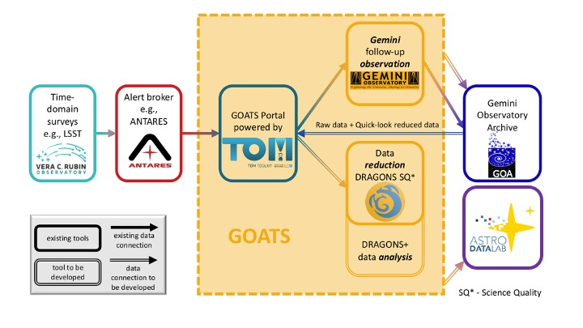

# 🐐 Gemini Observation and Analysis of Targets System (GOATS)


[](https://codecov.io/github/gemini-hlsw/goats)

---

_GOATS is an end-to-end integrated system for time-domain and multimesseneger astronomy (TDAMM) aimed towards Gemini follow-up observations._

**Documentation**: <a href="https://goats.readthedocs.io/en/latest/" target="_blank">https://goats.readthedocs.io/en/latest/</a>

**Source Code**: <a href="https://github.com/gemini-hlsw/goats" target="_blank">https://github.com/gemini-hlsw/goats</a>

Its objective is to simplify the TDAMM workflow for users by serving as a one-stop shop for all the follow-up needs. To this end, it will integrate the various TDAMM services of Gemini Observatory and the larger NOIRLab organization.



---

### Requirements

- `python=3.12`
- `conda`

## Development Status

🚧 The library is under development. Breaking changes will occur between releases.

## Installation

Detailed installation instructions can be found here: https://goats.readthedocs.io/en/latest/installation.html

```console
conda install -c https://gemini-hlsw.github.io/goats-infra/conda goats
```

Then install GOATS by using the `cli`:

```console
$ goats --help
```

Which will show you the available commands to install and run goats.

## Reporting Bugs and Feature Requests

**Jira**: https://noirlab.atlassian.net/jira/software/projects/GOATS/boards/57

**NOIRLab Slack channel**: `#goats`

While in development, please file requests or report bugs via our Jira board or Slack channel.

## Resources

- [GOATS Confluence](https://noirlab.atlassian.net/wiki/spaces/GOATS/overview)
- [GOATS Jira Board](https://noirlab.atlassian.net/jira/software/projects/GOATS/boards/57)
- [GOATS Documentation](https://goats.readthedocs.io/en/latest/)

## Development

To install GOATS for development, testing, and contributions please follow: https://goats.readthedocs.io/en/latest/developer_guide/environment.html

## Set Up `pre-commit`

To install `pre-commit` using `uv`, run:

```bash
uv tool install pre-commit --with pre-commit-uv
```

You may be prompted to add `.local/bin` to your `PATH`, `uv` installs tools there by default.

Next, install the hooks defined in `.pre-commit-config.yaml`:

```bash
pre-commit install
```

Once installed, `pre-commit` will automatically run the configured hooks each time you make a commit. This helps catch formatting issues, docstring violations, and other problems before code is committed.

To manually run all `pre-commit` hooks on the entire codebase:

```bash
pre-commit run --all-files
```
