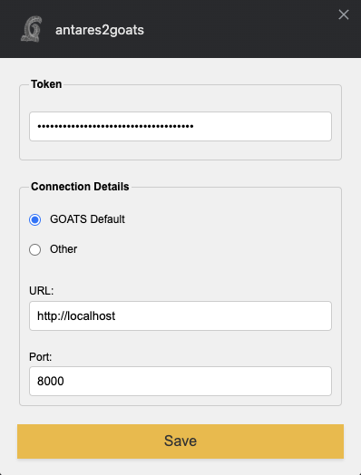
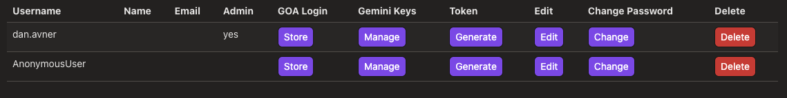
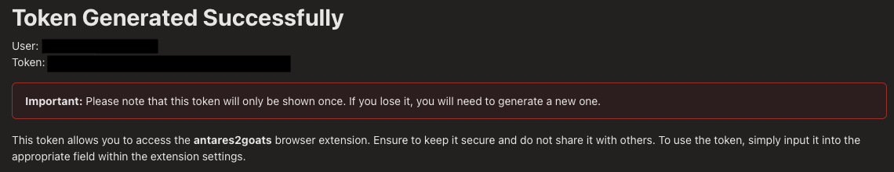

*************
Configuration
*************

Right-click the *antares2goats* extension badge and select **Options**. The following window appears:

   The extension's Options panel, showing **Token** and **Connection Details** fields.

Enter your *GOATS* authentication token in **Token**, then click **Save**. If you changed the default *GOATS* address or port, update them in **Connection Details**. Most users keep the defaults unless they've configured *GOATS* on a custom domain or port.

Getting Your Token
##################

Follow these steps to generate or retrieve your token from *GOATS*:

1. Log in to *GOATS*.
2. Click your username in the top-right corner, then select **Users**.
3. Locate your username in the list.

   The **Users** panel to generate authentication tokens for different accounts.

4. Click **Generate** to create a new token for the appropriate account.

   Example of a newly generated token. It appears only once.

5. Copy this token and paste it into the **Options** panel of the extension. If needed, regenerate it later to invalidate the old token and create a new one.