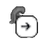
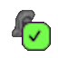
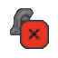

*******************
Using The Extension
*******************

The *antares2goats* extension interfaces with the |ANTARES| by letting you quickly save 
queries or loci to your *GOATS* instance. The badge icon in your toolbar 
changes to reflect the current state.

Saving a Query
##############

1. Navigate to the |ANTARES| query page and apply the filters you want.
2. Click the *antares2goats* icon in your browser toolbar.
3. If successful, the icon changes to a green check, indicating the filtered query 
   was saved to *GOATS*.

Saving a Loci
#############

1. Open a specific |ANTARES| loci page.
2. Click the extension icon in your browser toolbar.
3. A green check badge means the new target has been successfully added 
   to *GOATS*.

Badge States Explained
######################

Below are the various badge icons you might see while using the extension, 
along with their meanings.

Trusted Host (White Arrow Icon)
*******************************

.. _figure-trusted-host:

   **Trusted Host (White Arrow Icon)**

Indicates you are on an |ANTARES| page. The extension is actively parsing 
your location for queries or targets.

Default State (Grey X Icon)
***************************

.. _figure-default-state:

.. figure:: _images/inactive_badge.png
   :width: 15%
   :align: center

   **Default State (Grey X Icon)**

Shows that the extension isn’t recognizing the current page as |ANTARES|. 
No actions are possible here.

Successful Response (Green Check Icon)
**************************************

.. _figure-success:

   **Successful Response (Green Check Icon)**

A `2xx` response from *GOATS* means the data was successfully processed 
and saved.

Unauthorized (Red "TKN" Icon)
*****************************

.. _figure-unauthorized:

   **Unauthorized (Red "TKN" Icon)**

A `401` response signals that your token is invalid or missing. Update 
your token in the extension options.

Conflict (Yellow "DUP" Icon)
****************************

.. _figure-conflict:

   **Conflict (Yellow "DUP" Icon)**

A `409` response typically means you tried adding an entry that already 
exists in *GOATS*.

Error State (Red X Icon)
************************

.. _figure-error:

   **Error State (Red X Icon)**

Occurs when an unexpected error happens, such as a network failure or 
server issue. No data is saved.