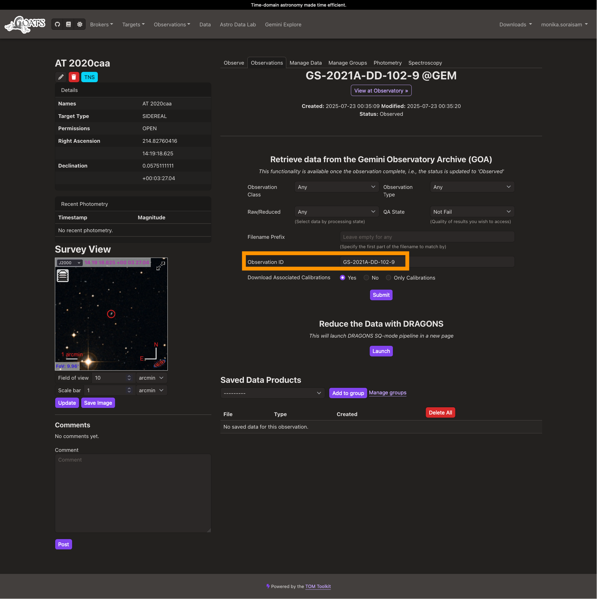

.. _goats_misc:

Miscellaneous
=============

.. _gem_program_ID:

Working with Gemini program ID
""""""""""""""""""""""""""""""

A target constitutes the most fundamental element in GOATS. The rest of the other functionalities like observation triggering, data download, data reduction, etc. follow from this element. A given Gemini program, uniquely identified by a **Program ID (e.g., GS-2021A-DD-102)**, may have more than one target, while each sequence of exposures executed for a given target is charcterized by a unique **Observation ID (e.g., GS-2021A-DD-102-9)**. Hence, on GOATS, users should use the `Observation ID` to link it to the relevant target for *existing Gemini observations*. This will create a dedicated observation page for that ID as described in :ref:`existing_obs`, which will allow automatically downloading the data from GOA.   

However, if the user wishes to instead download/work with the data of the whole program, i.e., at the Program ID level, then they can use a workaround. First, they should use any Observation ID within that program to create the observation page. Once done, they can edit the *Observation ID* field in the GOA section of the page (highlighted by the orange rectangle in the figure below) and change it to the desired Program ID and hit Submit. 

.. _goats-download-progid:

   Users can edit the Observation ID field, highlighted by the orange rectangle, to change it to the Program ID to download the full data corresponding to the program (click on the image to see an enlarged version). 
