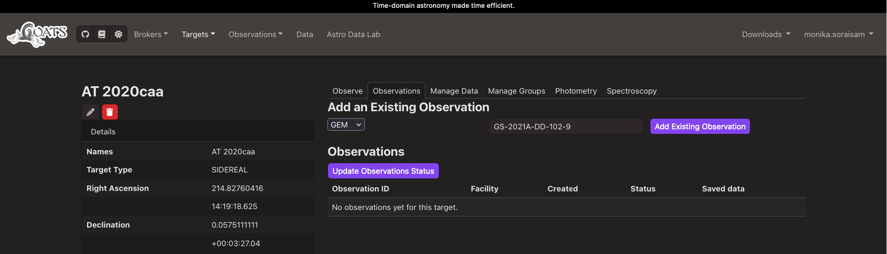
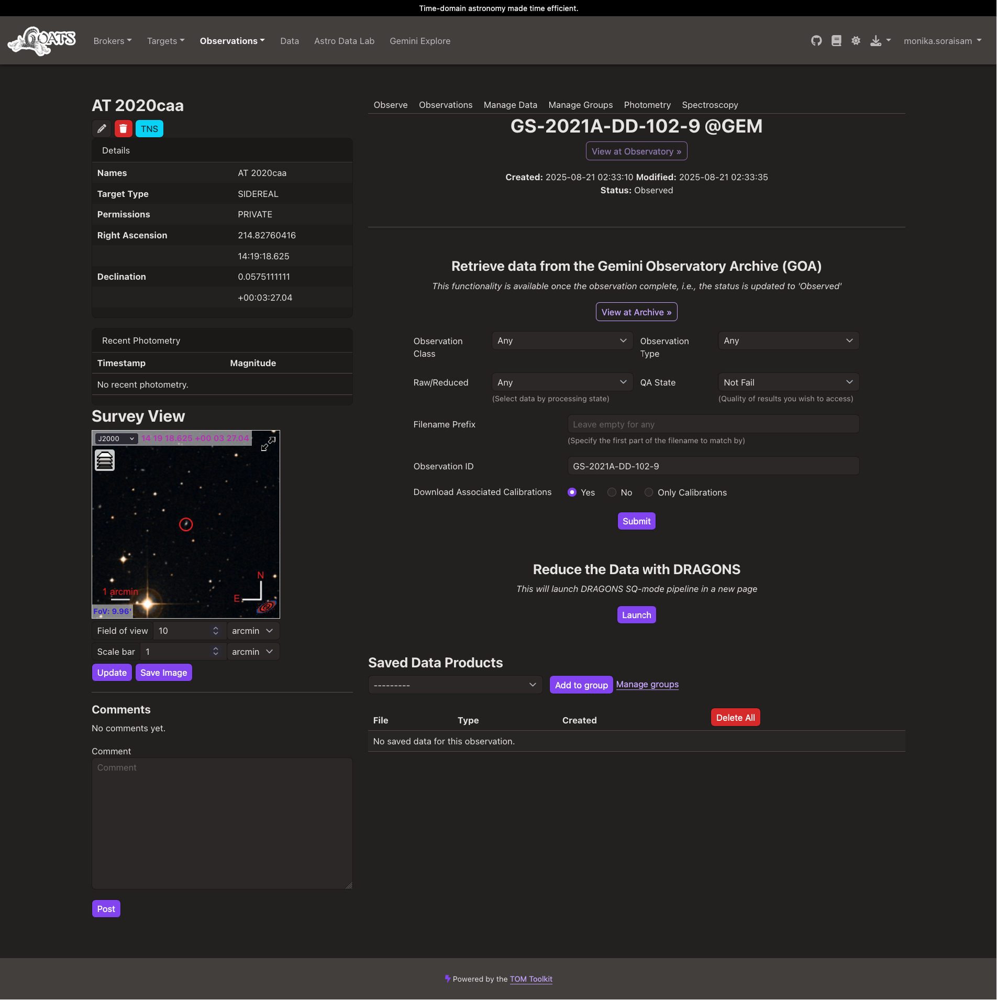

.. _existing_obs:

Add existing observation
------------------------

Users can add a past/existing Gemini observation of a target on GOATS to create a dedicated page for the given observation ID. 

.. note::  
   For Gemini observations, make sure that the ID you are adding is the *observation ID* and **not** the *program ID*. Then, click the ``Update Observation Status`` button to retrieve the status of the observation from the Gemini Observing Database. 

   If one would rather have the data for a given Gemini program ID, follow the instructions in :ref:`gem_program_ID`.

.. _goats-add-existing-obs:

   Option to add an existing Gemini observation ID for a given target on GOATS (click on the image to see an enlarged version). 

The image below shows the resulting dedicated observation page for the ID added (see also the video in :ref:`goa_download`). 

.. _goats-obs-page:

   Dedicated page for the Gemini observation ID added for a given target on GOATS  (click on the image to see an enlarged version). 
