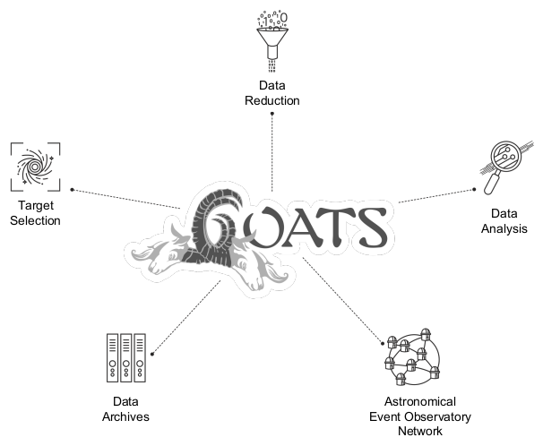
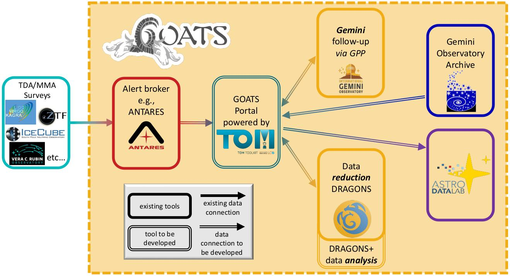

.. _about-goats:

GOATS: Gemini Observation and Analysis of Targets System
========================================================

**GOATS** is a browser-based user interface providing end-to-end automation of the entire time-domain/multi-messenger astronomy follow-up process -- from target selection, over triggering of follow-up observation, over data retrieval, to data reduction and analysis (:numref:`goats-capabilities`). 

.. _goats-capabilities:

   GOATS will integrate all the software services involved in time-domain and multi-messenger astronomy follow-up. 

It serves as a Target and Observation Manager (TOM) that can be used out-of-the-box. It is built using the |TOMToolkit|, however it, in itself, is not a software development kit but rather a fully-assembled TOM. Its main motivation is to lower the entry barrier for the user community.  

.. _goats-schematic:

   Schematic of GOATS, highlighting its building blocks. 

The main components of GOATS are shown in :numref:`goats-schematic` above. It is primarily directed towards Gemini follow-up observations, while leveraging complementary services (see :ref:`below <building-blocks>`) for time-domain astronomy built by programs across the larger NOIRLab organization. 

.. note::  
   Even though GOATS is designed to increase the efficiency of time-domain/multi-messenger follow-up observations with Gemini, it can be used by any Gemini user interested in automation.   

.. _building-blocks:

Building blocks of GOATS
========================
GOATS relies on the following components - 

* |ANTARES| : NOIRLab's alert broker for target selection.
* |TOMToolkit| : Software for building and customizing TOMs developed by the Las Cumbres Observatory. 
* |GPP| : Upgraded Observatory Control System of Gemini, which will facilitate Gemini triggering and observations. 
* |GOA| : Gemini data archive.
* |DRAGONS| : Gemini data reduction software.
* |Dlab| : NOIRLab's science platform, which provides access to various legacy catalogs and a JupyterHub environment.  

.. toctree::
   :maxdepth: 3
   :hidden:
   :caption: Table of Contents

   installation.rst
   overview.rst
   functionalities.rst
   team.rst
   acknowledgment.rst
   help.rst

.. toctree::
   :maxdepth: 3
   :hidden:
   :caption: Browser Extension

   antares2goats/index.rst

.. toctree::
   :numbered:
   :maxdepth: 1
   :hidden:
   :caption: Appendices

   appendices/goats_cli.rst
   appendices/goats_cli_troubleshoot.rst
   appendices/misc.rst

