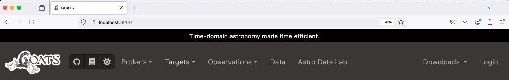

.. overview.rst

.. _overview:

GOATS Interface overview
========================

GOATS runs on the web-browser locally, i.e., on your ``localhost`` (IP address ``127.0.0.1``) at the default port number 8000. Users can choose a different port number, if desired (see :ref:`goats_cli`). 

.. _goats-landing:

   Navigation bar on GOATS landing page. Click the image to see an enlarged version.

The various buttons on the top navigation bar are described below.

1. The **Brokers** button can be used to access one of the brokers: ANTARES, ALeRCE, Gaia, or Scout to select time-domain targets, as well as queries for these brokers saved by the user. 

2. The **Targets** button can be used to navigate to the list of saved targets, including target groupings applied by the user. 

3. The **Observations** button can be used to access the observations for specific targets, observation groupings applied by the user, saved observation templates, as well as real-time status of the Gemini telescopes. 

4. The **Data** button links to a page displaying all the saved data products on GOATS.

5. The **Astro Data Lab** button links to the Astro Data Lab science platform of NOIRLab. 

6. The **Gemini Explore** button links to the Explore webpage, used for preparing Gemini proposals (applicable when the Gemini Program Platform goes live). 

7. The **fifth icon** from right, i.e., the GitHub icon links to the GitHub repository of GOATS where our codebase resides, the **fourth icon** links to this documentation website, the **third icon** can be used to toggle between light and dark mode, and the **second icon** can be used to monitor the progress of data downloads. 

8. Finally, the **Login** button can be used to log into the GOATS interface using the username and password created during installation (see :ref:`install`).   

.. _managing_credential:

Managing Credentials
--------------------
GOATS provides the option for users to securely store their login credentials for services such as the Gemini Observatory Archive, Astro Data Lab, etc. This needs to be done *only once* via the **Users** page accessible from the drop-down menu under the user name (also accessible from the pop-up notification on the landing page; see the video below). Once done, users will then be able to access their proprietary Gemini data, transfer data to their Astro Data Lab account, communicate with the Gemini Program Platform, Transient Name Server, etc.  

The video below walks through the buttons on the navigation bar as well as how to manage user credentials. 

.. _overview-video:
.. video:: _static/overview.mp4
   :align: center
   :alt: GOATS overview 
   :muted:
   :width: 80%

