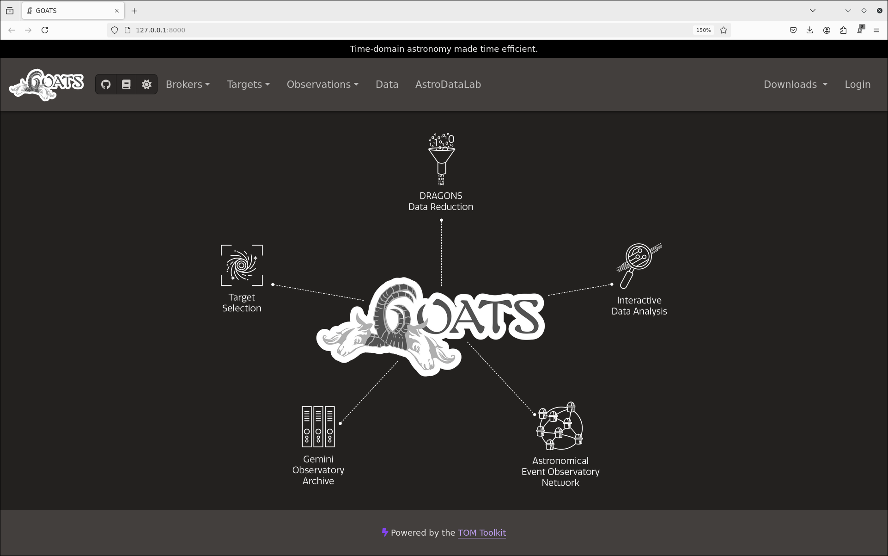

.. overview.rst

.. _overview:

GOATS Interface overview
========================

GOATS runs on the web-browser locally, i.e., on your ``localhost`` (IP address ``127.0.0.1``) at the default port number 8000; click the figure below (:numref:`goats-landing`) to see an enlarged version. Users can choose a different port number, if desired (see :ref:`goats_cli`). 

.. _goats-landing:

   Landing page of GOATS. 

The various buttons at the top navigation bar are described below.

* The second icon from left, i.e., the **GitHub icon** links to the GitHub repository of GOATS where our codebase resides, while the **third icon** links to this documentation website and the **fourth icon** can be used to toggle between light and dark mode. 

* The **Brokers** drop-down menu button can be used to access one of the brokers: ANTARES, ALeRCE, Gaia, and Scout to select time-domain targets, as well as queries for these brokers saved by the user. 

* The **Targets** drop-down menu button can be used to navigate to the list of saved targets, including target groupings applied by the user. 

* The **Observations** drop-down menu button can be used to access the observations for specific targets, observation groupings applied by the user, saved observation templates, as well as status of the various facilities supported by the TOM-Toolkit/GOATS (presently Gemini, Las Cumbres Observatory, and SOAR). 

* The **Data** button links to a page displaying all the saved data products on GOATS.

* The **AstroDataLab** button will link to NOIRLab's Astro Data Lab science platform. 

* The **Downloads** drop-down menu button can be used to monitor the progress of data downloads. 

* Finally, the **Login** button can be used to log into one's own GOATS interface using the username and password created during GOATS installation (see :ref:`install`).   

The video below shows a walk-through of these buttons. 

.. _overview-video:
.. video:: _static/overview.mp4
   :alt: GOATS overview 
   :muted:
   :width: 80%

